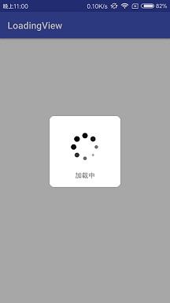

<h1>Usage

<h4>Step 1

<h6>Project Gradle:

```
    allprojects {
        repositories {
            ...
            maven { url "https://jitpack.io" }
            }
            }
```

<h6>App Gradle:
```
   dependencies {
   	        compile 'com.github.Jelen0101:LoadingView:v1.0.0'
   	}
```

<h4>Step 2

```java
  mLoadingView = new LoadingView.Builder(this)
                .text("加载中")
                .build();
  mLoadingView.showInCenter();
```

<h1>Thanks</h1>

[AVLoadingIndicatorView](https://github.com/81813780/AVLoadingIndicatorView)
